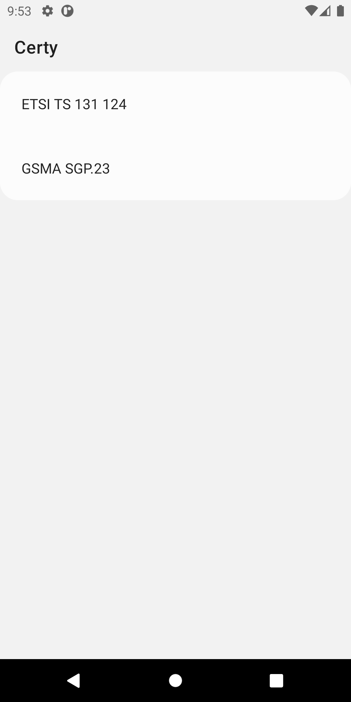
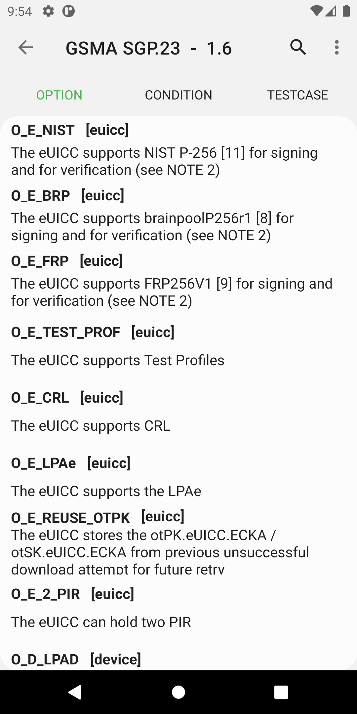
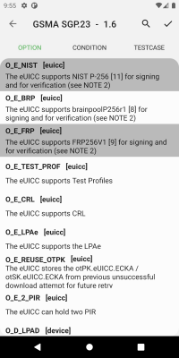

Certy
=====

An application provides information specified in standard test speicification such as GSMA SGP.23 or ETSI TS 131 124.

Those specification specifies many test cases, optional features and conditions. Test cases that device must have conducted is extracted based on combination of optional features and conditions.

This application will helps that which test cases should be tested by devices or which conditions are related to test cases.

Certy is under developing now.

Libraries used
--------------

Certy tries to use jetpack libraries as possible such as LiveData, DataBinding, Navigtaion and so on.

Screenshots
-----------

